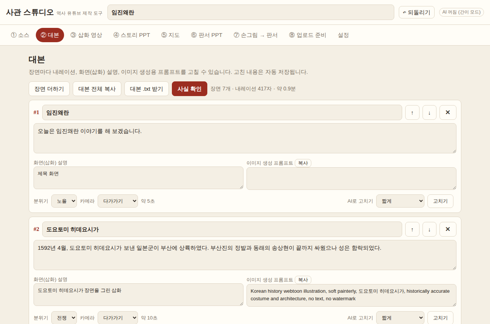
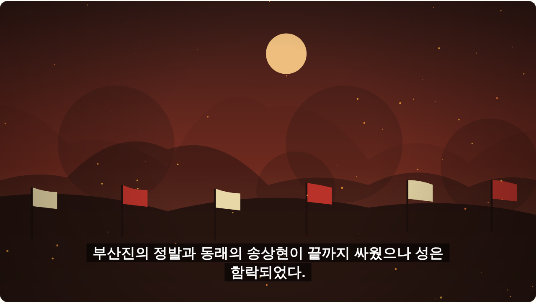
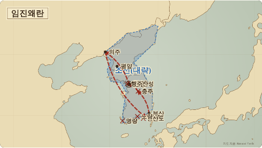
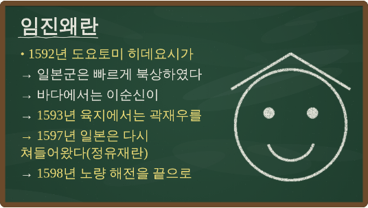
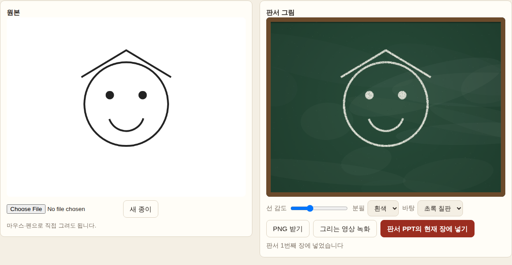

# 사관 스튜디오 — 역사 유튜브 제작 도구

소스(교과서 본문, 사료 번역, 강의 메모)를 넣으면 **대본**을 짓고, 그 대본으로
**삽화 영상 · 스토리 PPT · 지도 · 판서 PPT**를 만들며, 종이에 그린 캐릭터를
**칠판 분필 그림**으로 바꿔 주는 도구입니다.

`index.html`을 브라우저(크롬·엣지 권장)로 열면 바로 쓸 수 있습니다. 설치도 서버도 필요 없습니다.

| 대본 | 삽화 영상 | 지도 |
|---|---|---|
|  |  |  |

| 판서 PPT | 손그림 → 판서 | 썸네일 |
|---|---|---|
|  |  |  |

## 만드는 순서

1. **① 소스** — 글을 붙여 넣거나 파일을 넣습니다. `.txt`는 글칸에 들어가고, **PDF와 사진**(교과서·사료 쪽을 찍은 것)은
   첨부로 들어가 AI 모드에서 Claude가 직접 읽습니다. 영상 길이·시청자·말투를 고르고 **대본 만들기**.
   - 설정에 Anthropic API 키를 넣으면 Claude가 대본·판서·지도(지명, 경로, 나라 판도 영역, 지도로 보여 줄 장면)를 한 번에 짜 줍니다.
   - 키가 없으면 문장을 장면으로 나누고 지명·연도를 뽑는 **간이 모드**로 만듭니다.
2. **② 대본** — 장면마다 내레이션, 화면(삽화) 설명, 이미지 생성용 영어 프롬프트를 고칩니다.
   - **AI로 고치기**: 장면 하나만 짧게 / 쉽게 / 더 극적으로 / 사료 인용 넣기 / 질문으로 시작 / 직접 요청.
   - **사실 확인**: Claude가 대본의 주장(인물·연도·장소·숫자·인과)을 소스와 맞대어 보고,
     "소스와 다름 · 소스에 없음 · 해석이 갈림"을 근거 구절과 함께 알려 줍니다. 문제 있는 장면에는 표시가 붙습니다.
3. **③ 삽화 영상** — 장면 그림에 천천히 확대·이동(켄 번스)과 자막을 입혀 **WebM**으로 녹화합니다.
   - **AI로 그리기**: Claude가 장면을 웹툰 풍 SVG 그림으로 그립니다. 그림은 먼 배경·주인공·앞 가림 세 겹이라
     겹마다 다르게 움직여 깊이가 생깁니다(시차 효과). "빈 장면 모두 AI로 그리기"로 한꺼번에 그릴 수 있습니다.
   - **그림 파일**: 직접 그리거나 다른 이미지 생성 도구로 만든 그림을 넣을 수 있습니다.
   - **지도 장면**: 삽화 대신 경로가 그려지는 지도를 보여 줍니다.
   - **목소리**: 장면마다 마이크로 녹음하거나 음성 파일(클로바더빙·타입캐스트 등에서 받은 mp3/wav)을 넣으면
     장면 길이가 목소리에 맞춰지고 자막도 목소리에 맞춰 흐르며, 녹화한 영상에 소리가 함께 들어갑니다.
     "읽어 듣기"는 브라우저가 읽어 주는 미리 듣기용입니다(녹화에는 들어가지 않습니다).
   - 그림이 없는 장면은 분위기(바다·전쟁·궁궐·눈 …)에 맞는 배경을 그려 넣습니다.
   - **배경음악**: 음악 파일을 넣으면 영상 길이만큼 반복하고, 처음은 서서히 커지고 끝은 서서히 사라지며,
     내레이션이 나오는 동안에는 자동으로 작아집니다.
   - 미리보기 아래 **위치 막대**로 원하는 곳을 바로 볼 수 있고, 목소리가 없는 장면은 **길이(초)**를 직접 정할 수 있습니다.
4. **④ 스토리 PPT** — 장면마다 한 장, 내레이션은 발표자 노트로 들어갑니다. 지도 슬라이드도 함께.
5. **⑤ 지도** — 대본의 지명을 찍고 경로를 화살표로 잇습니다. 옛 지도 / 깔끔한 지도 / 칠판 양식,
   PNG로 받거나 **경로가 그려지는 영상**으로 녹화합니다. 경로는 `부산 > 한양 : 일본군 북상`처럼 적습니다.
   - **영역 그리기**: 지도 위를 차례로 눌러 나라의 판도나 점령지를 반투명하게 칠합니다(색·이름 수정 가능).
6. **⑥ 판서 PPT** — 칠판에 분필로 쓴 듯한 요약. 글자는 PowerPoint에서 고칠 수 있는 텍스트로 들어갑니다.
   - `- 줄` 들여쓰기 · `*줄` 노란 분필 · `!줄` 분홍 분필 · `[글]` 네모 칸 · 줄 가운데 `*낱말*` 노란 강조
   - **판서 쓰는 영상 녹화**: 분필로 한 글자씩 써 나가는 영상을 모든 장에 걸쳐 녹화합니다.
7. **⑦ 손그림 → 판서** — 종이 그림 사진을 넣거나 화면에 직접 그리면 분필 그림으로 바꿉니다.
   PNG(투명 바탕 가능)로 받거나 판서 PPT의 현재 장 오른쪽에 붙입니다.
   - **그리는 영상 녹화**: 분필 그림이 한 획씩 그려지는 영상을 만듭니다. 화면에 그린 그림은 그린 순서 그대로,
     사진으로 넣은 그림은 선을 따라 획을 찾아 가까운 획부터 이어 그립니다.
8. **⑧ 업로드 준비** — 유튜브에 올릴 때 필요한 것들.
   - **자막 .srt**: 영상 속 자막과 같은 시각으로 만든 자막 파일. 유튜브 스튜디오 → 자막 → 파일 업로드.
   - **챕터**: 장면 시작 시각으로 `0:00 제목` 목록을 만듭니다(유튜브 규칙: 0:00 시작, 10초 이상 간격).
   - **제목·설명·태그**: Claude가 제목 후보 5개, 설명(챕터 자동 포함), 태그, 썸네일 문구, 고정 댓글을 짓습니다.
     키가 없으면 간단한 틀을 만들어 줍니다.
   - **썸네일**: 장면 그림 위에 굵은 글씨를 얹은 1280×720 PNG. 배경 장면·색·글씨 자리를 고를 수 있습니다.

**↶ 되돌리기**: 대본을 새로 만들거나 AI로 고치기·다시 그리기, 백업 불러오기, 새 프로젝트 전에 그때 상태를
자동으로 남깁니다(최근 10개). 오른쪽 위 버튼이나 설정 탭에서 골라 되돌릴 수 있습니다.

프로젝트(그림·목소리 포함)는 브라우저(IndexedDB)에 자동 저장되며, **설정 → 프로젝트 백업(.json)** 으로
파일로 보관·이동할 수 있습니다(API 키는 백업에 들어가지 않습니다).

## 알아 둘 것

- 판서 PPT는 `Nanum Pen Script` 글꼴을 씁니다. 발표할 컴퓨터에 [나눔손글씨 펜](https://fonts.google.com/specimen/Nanum+Pen+Script)을 설치하면 분필 글씨처럼 보입니다.
- 영상 녹화는 실제 시간만큼 걸립니다(5분 영상 → 5분). 녹화 중에는 탭을 바꾸지 마세요.
  브라우저가 지원하면 **MP4**로, 아니면 WebM으로 녹화합니다(설정에서 바꿀 수 있음). 둘 다 유튜브에 바로 올릴 수 있고,
  편집 프로그램(캡컷, 다빈치 리졸브 등)에 넣기에는 MP4가 편합니다.
- PDF는 30MB까지, 사진은 긴 변 1600px로 줄여서 보냅니다. 첨부 파일은 요청마다 함께 보내므로
  장면 고치기·사실 확인을 할 때도 그만큼 값이 듭니다(같은 작업을 되풀이하면 캐시로 조금 줄어듭니다).
- AI 비용(어림): 대본 한 번 수백 원, 장면 그림 한 장 100~300원, 사실 확인 한 번 수백 원.
  설정 탭에서 지금까지 쓴 금액(어림)을 볼 수 있습니다. 그림은 Claude Sonnet 5로 바꾸면 더 쌉니다.
- AI 그림은 SVG(벡터)라 사진 같은 그림보다는 웹툰·일러스트 풍입니다. 더 정교한 그림이 필요하면
  대본 탭의 이미지 프롬프트를 이미지 생성 도구에 넣어 만든 뒤 "그림 파일"로 넣으세요.
- 지도의 판도 영역은 **대략적인 표시**입니다. 수업·영상에 쓰기 전에 교과서 지도와 맞춰 보세요.
  해안선: [Natural Earth](https://www.naturalearthdata.com/) (public domain).
- 마이크 녹음은 브라우저가 마이크 권한을 물어봅니다. `file://`로 열었을 때 크롬에서 녹음이 막히면
  음성 파일을 넣는 방법을 쓰세요.

## 개발

```
npm install          # playwright, pptxgenjs, world-atlas, topojson-client
npm test             # 끝에서 끝까지 시험 30개 (AI 응답은 가짜로)
npm run vendor       # PptxGenJS 번들과 지도 자료(content/geo.js)를 다시 만들 때
node tools/screens.mjs   # README 화면 사진 다시 찍기
```

코딩 에이전트용 안내는 [`AGENTS.md`](AGENTS.md)에 있습니다.
