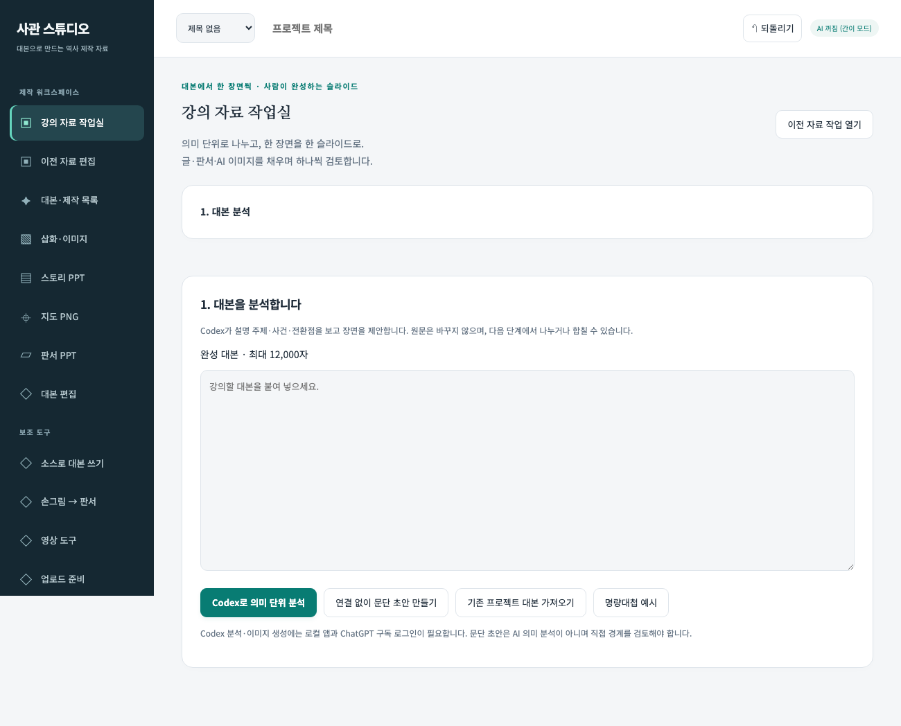
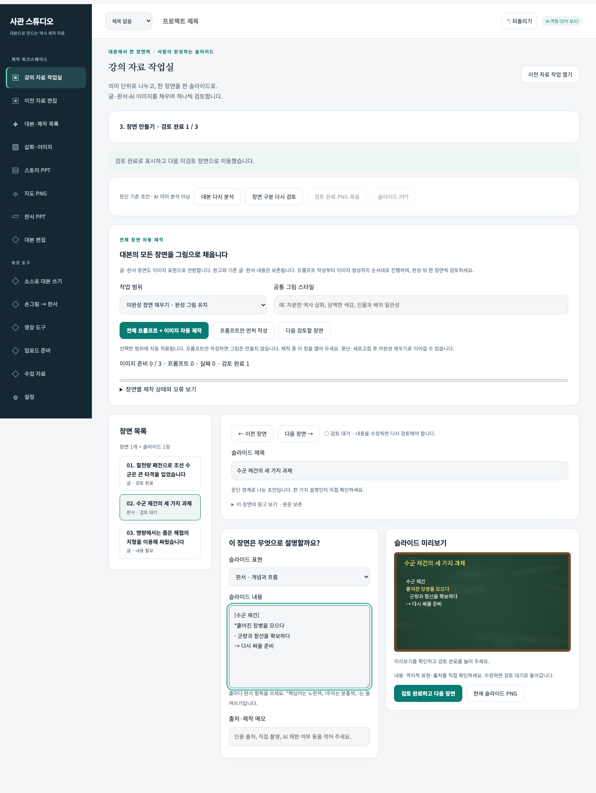
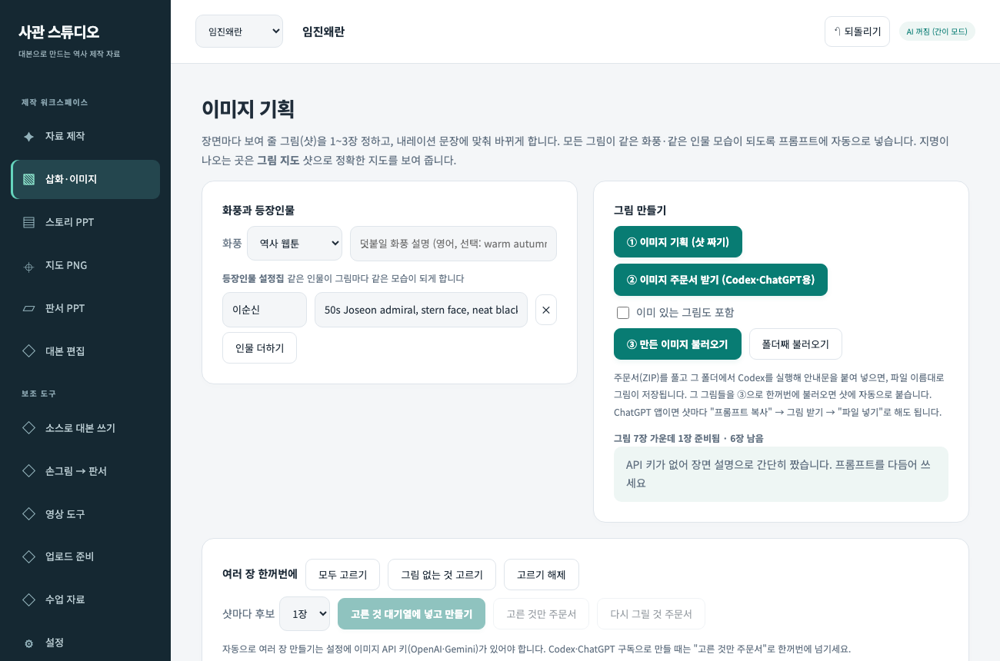
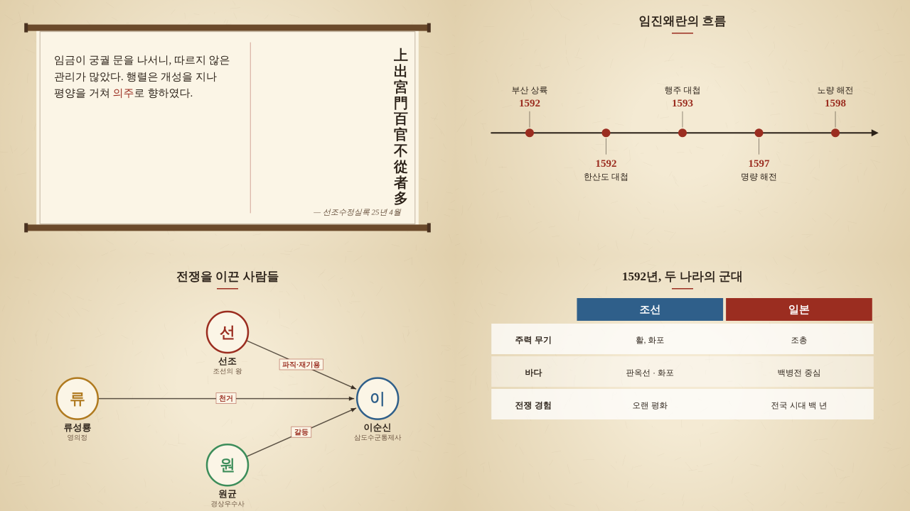
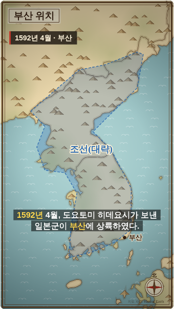
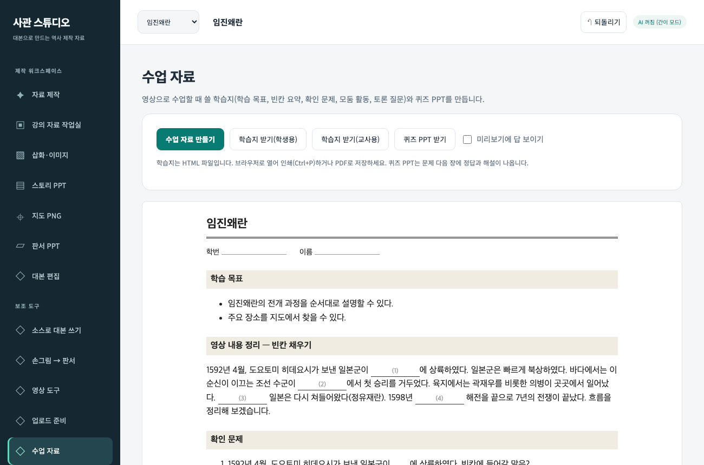
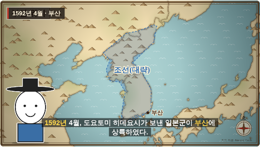
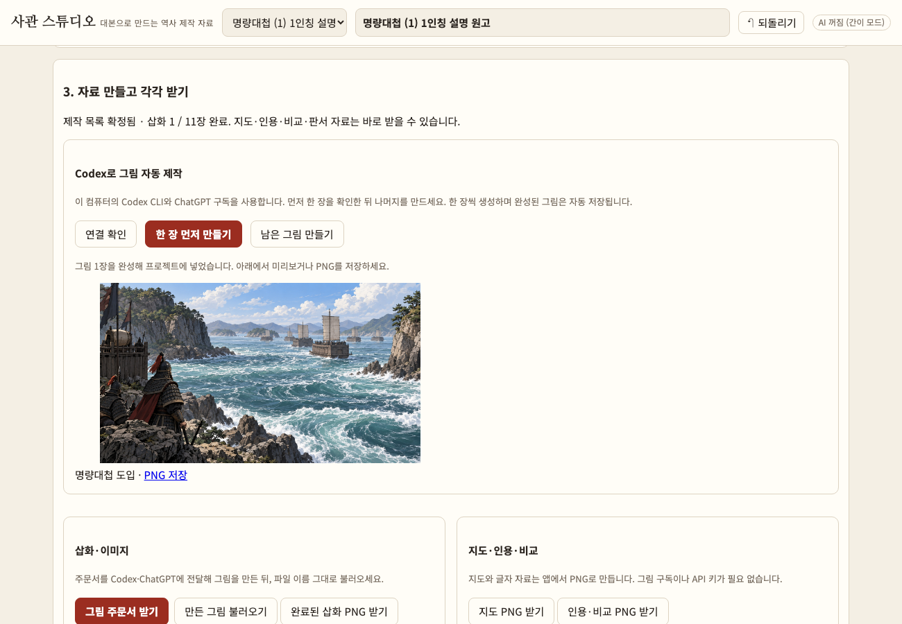
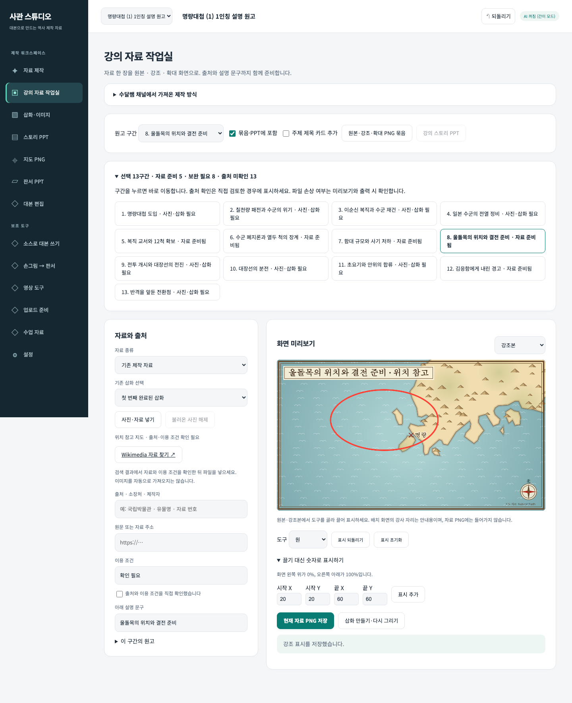

# 사관 스튜디오 — 한 장면씩 만드는 강의 슬라이드

**대본을 의미 단위로 나누고, 한 장면을 글·판서·이미지 슬라이드 한 장으로 채우며 사람이 검토하는 도구**입니다.

맥에서 **사관 스튜디오 실행.command**를 더블클릭해 엽니다. 기본 화면은 **강의 자료 작업실**입니다. Codex 의미 분석과 이미지 생성은 ChatGPT 구독 로그인과 로컬 서버를 사용하며 유료 API로 전환하지 않습니다. 파일로 직접 열 때는 문단 초안과 직접 편집·사진 불러오기·저장을 사용할 수 있습니다.



## 지금 쓰는 순서

1. **대본 입력** — 최대 12,000자. 기존 프로젝트 대본을 가져오거나 명량 예시로 시작할 수 있습니다.
2. **Codex로 의미 단위 분석** — 설명 주제·사건·전환점에 따라 장면과 표현 방식을 제안합니다. 원문 범위로 연결해 누락·중복을 검사합니다. 인터넷 연결 없이 쓰는 **문단 초안**은 AI 의미 분석이 아닙니다.
3. **장면 구분 검토** — 장면별 원고와 나눈 이유를 확인합니다. 원고의 커서 위치에서 나누거나 다음 장면과 합칩니다. 이때 해당 장면의 슬라이드 내용은 비우며 변경 전 복원 기록을 남깁니다.
4. **구분 확정 → 장면 만들기** — 한 장면을 정확히 한 슬라이드로 봅니다. 글은 핵심 문장, 판서는 개념·흐름을 직접 다듬습니다. 이미지는 **원고로 이미지 프롬프트 자동 작성**으로 초안을 받아 검토·적용하거나 직접 지시를 적은 뒤 **이 장면만 Codex로 생성**하거나 사진을 넣습니다. 다른 장면은 자동 생성하지 않습니다.
5. **검토 완료하고 다음 장면** — 원고·미리보기·역사적 표현·출처를 확인합니다. 내용을 바꾸면 검토 대기로 돌아갑니다. 다시 생성한 그림의 이전 후보는 최대 3개 보관합니다.
6. **저장** — 모든 장면을 검토 완료하면 PNG ZIP 또는 PPT를 받습니다. 장면이 10개면 PNG 10장, PPT 10슬라이드입니다. 현재 장면만 PNG로 받을 수도 있습니다. 원고·출처는 ZIP 목록과 PPT 발표자 노트에 남습니다.



PNG는 1920×1080이고 PPT는 동일한 화면을 이미지로 넣습니다(슬라이드 안의 글자는 PowerPoint에서 개별 편집되지 않음). 편집은 앱에서 한 뒤 다시 저장하세요. 분석과 AI 그림은 초안이므로 역사적 정확성은 직접 확인해야 합니다.

기존 자료·지도·판서·그림 주문서 작업은 **이전 자료 편집**, **대본·제작 목록** 등에 보존됩니다. 새 장면 슬라이드는 별도 상태로 저장하므로 기존 자료를 자동으로 덮어쓰지 않습니다. 프로젝트 백업에는 새 장면 작업도 포함됩니다. 상단 되돌리기는 기록 시점의 프로젝트 전체를 복원합니다.

## 기존 세부 도구

대본 편집·그림 후보 관리·손그림 변환·영상 도구 등은 상단 탭에 남아 있습니다. 아래는 그 세부 기능 안내입니다. 완성 대본으로 자료를 만들 때는 **강의 자료 작업실**에서 시작하세요.

| 대본 | 🎨 이미지 기획 | 그림 지도 |
|---|---|---|
|  |  |  |

| 판서 PPT | 손그림 → 판서 | 썸네일 |
|---|---|---|
|  |  |  |

역사 장면 종류 — 사료 · 연표 · 인물 관계도 · 비교표



| 쇼츠(세로) | 수업 자료 | 내 캐릭터 |
|---|---|---|
|  |  |  |

## 소스에서 대본까지 새로 쓰는 기존 흐름

1. ① 소스에 글이나 PDF를 넣고 **✨ 한 번에 만들기 → 시작**. 대본·판서·지도 → (AI 그림) → (사실 확인) → 제목·설명·태그 → 수업 자료를 차례로 만듭니다. 시작 전에 예상 비용을 보여 주고, 도중에 멈출 수 있습니다.
2. ③ 삽화 영상에서 **🎙 프롬프터 녹음**으로 대본을 읽어 목소리를 넣고, 필요하면 내 캐릭터·배경음악을 넣은 뒤 **영상 녹화**.
3. ⑧ 업로드 준비에서 **📦 모두 받기(ZIP)** — 대본, 자막, 챕터, 업로드 정보, PPT 3종, 학습지, 썸네일, 지도, 장면 그림, 캐릭터, 백업이 한 파일로.

## 세부 도구 사용법

**프로젝트**: 영상마다 프로젝트를 하나씩 만드세요. 오른쪽 위 목록에서 프로젝트를 바꾸거나 "+ 새 프로젝트"를 고릅니다.
설정 탭에서 복제·지우기·백업을 할 수 있고, 백업 파일을 불러오면 새 프로젝트로 들어옵니다.

1. **① 소스** — 글을 붙여 넣거나 파일을 넣습니다. `.txt`는 글칸에 들어가고, **PDF와 사진**(교과서·사료 쪽을 찍은 것)은
   첨부로 들어가 AI 모드에서 Claude가 직접 읽습니다. 영상 길이·시청자·말투를 고르고 **대본 만들기**.
   - **참고 영상(유튜브)**: 영상 아래 **…더보기 → 스크립트 표시**의 자막을 복사해 붙여 넣으면 시각 표시·[음악] 같은 표시가
     저절로 지워집니다. 주소를 넣으면 제목과 채널 이름을 채웁니다. 참고 방식은 둘 중 하나를 고릅니다.
     - **사실 자료로 참고**: 내용을 자료로 쓰되 문장은 새로 씁니다. 사실 확인에서도 근거로 씁니다.
     - **구성·말투만 참고**: 도입·질문 던지기·전개 속도·마무리 같은 방식만 본뜨고, 그 영상의 내용과 문장은 쓰지 않습니다.
     - 참고한 영상은 업로드 설명란 끝에 "📚 참고 자료"로 자동으로 붙습니다.
     - 주소만으로 자막을 자동으로 가져오지는 못합니다(유튜브가 다른 사이트의 자막 읽기를 막고 있음).
       남의 영상 문장을 그대로 옮기면 저작권 문제가 생길 수 있으니, 교과서·사료 같은 1차 자료와 함께 쓰세요.
   - 설정에 Anthropic API 키를 넣으면 Claude가 대본·판서·지도(지명, 경로, 나라 판도 영역, 지도로 보여 줄 장면)를 한 번에 짜 줍니다.
   - 키가 없으면 문장을 장면으로 나누고 지명·연도를 뽑는 **간이 모드**로 만듭니다.
2. **② 대본** — 장면마다 내레이션, 화면(삽화) 설명, 이미지 생성용 영어 프롬프트를 고칩니다.
   - **장면 나누기**: 내레이션에서 나눌 곳을 눌러 커서를 놓고 **커서에서 나누기**. 그림 목록은 문장 위치에 맞게 나뉘고, 이어지는 그림은 뒷 장면에도 남습니다.
   - **장면 합치기**: **다음 장면과 합치기**를 누릅니다. 내레이션과 삽화 장면의 그림 목록을 연결하며, 장면 종류·자료·배경·인물·전환은 앞 장면 설정을 유지합니다. SVG 움직임은 정지 그림으로 바뀝니다.
   - **순서 바꾸기**: **↕ 끌기** 손잡이를 다른 장면으로 옮기거나 ↑↓를 누릅니다. 휴대폰과 키보드에서는 ↑↓를 사용하세요. 썸네일·퀴즈·사실 확인의 장면 번호도 따라갑니다.
   - 나누기·합치기·순서 변경·삭제 전에는 **설정 → 되돌리기 기록**에 원본을 남깁니다. 나누거나 합친 장면은 길이를 다시 계산하며, 녹음이 있으면 확인 후 지우므로 다시 녹음해야 합니다. 사실 확인 결과는 초기화되고, 수업 자료 내용은 다시 검토하세요.
   - **AI로 고치기**: 장면 하나만 짧게 / 쉽게 / 더 극적으로 / 사료 인용 넣기 / 질문으로 시작 / 직접 요청.
   - **사실 확인**: Claude가 대본의 주장(인물·연도·장소·숫자·인과)을 소스와 맞대어 보고,
     "소스와 다름 · 소스에 없음 · 해석이 갈림"을 근거 구절과 함께 알려 줍니다. 문제 있는 장면에는 표시가 붙습니다.
3. **🎨 이미지** — 대본에 맞는 그림을 장면마다 1~3장(샷) 정합니다. **이 도구의 중심 기능입니다.**
   - **화풍** 하나(역사 웹툰·수묵 담채·역사화·교과서 삽화·민화풍·다큐 재연 사진)와 **등장인물 설정집**(인물마다 생김새)을 정하면,
     모든 그림 프롬프트에 자동으로 붙어 영상 전체가 한 사람이 그린 것처럼 이어지고 같은 인물은 같은 모습이 됩니다.
   - **① 이미지 기획**: Claude가 내레이션 문장마다 무엇을 보여 줄지 정합니다 — 전경 · 사건 장면 · 인물 · 유물 클로즈업 · **그림 지도**.
     샷은 영상에서 그 문장이 나올 때 바뀝니다. 그림 지도 샷은 정확한 해안선·지명 위에 산·물결·성·나침반을 그린 일러스트 지도로 보여 줍니다
     (AI 그림은 지도의 위치·글자를 틀리기 쉬워서 지도는 앱이 그립니다). 키가 없으면 장면 설명으로 간단히 짭니다.
   - **② 이미지 주문서 (Codex·ChatGPT용)**: 남은 그림의 프롬프트·파일 이름·크기와 Codex에 붙여 넣을 안내문이 든 ZIP입니다.
     구독하시는 Codex(또는 ChatGPT 앱)로 그림을 만들어 파일 이름대로 저장합니다. 자세한 차례는 [`docs/CODEX.md`](docs/CODEX.md)의 "이미지 만들기".
   - **③ 만든 이미지 불러오기**: 그림 파일들(또는 폴더째)을 한꺼번에 불러오면 파일 이름(`S03-2_ab12.png`)으로 샷을 찾아 붙습니다.
     샷마다 "프롬프트 복사 → 그림 받기 → 파일 넣기"로 한 장씩 해도 되고, 설정에 이미지 API 키가 있으면 바로 만들 수도 있습니다.
   - **🔁 다시 그리기**: 그림이 마음에 안 들면 샷에서 "다시 그리기"를 누르고 고칠 점(예: "더 어둡게, 얼굴을 크게")을 적습니다.
     Claude가 고칠 점을 영어 프롬프트에 반영하고(키가 없으면 끝에 덧붙임), **바로 다시 그리기**(이미지 API, 후보 1~4장) 하거나
     **다음 주문서에 넣기**(Codex·ChatGPT용)를 고릅니다. 전 그림은 **후보**로 남아, 작은 그림을 누르면 언제든 그 그림으로 되돌립니다.
   - **여러 장 한꺼번에 · 대기열**: 샷을 체크해 고르고(모두 / 그림 없는 것만) **고른 것 대기열에 넣고 만들기**를 누르면
     샷마다 후보 수만큼 차례로 만듭니다. 동시에 1~3장, 멈추기·이어 하기, 실패한 것만 다시 하기, 오른쪽 위에 진행 표시.
     잠깐 붐빌 때는 알아서 다시 시도하고, 키가 틀리면 나머지를 멈춥니다. (자동 생성은 이미지 API 키가 있을 때만 됩니다.)
     Codex·ChatGPT 구독으로 만들 때는 **고른 것만 주문서** / **다시 그릴 것 주문서**로 한꺼번에 넘깁니다.
4. **③ 삽화 영상** — 장면 그림에 천천히 확대·이동(켄 번스)과 자막을 입혀 **WebM**으로 녹화합니다.
   - **AI로 그리기**: Claude가 장면을 웹툰 풍 SVG 그림으로 그립니다. 그림은 먼 배경·주인공·앞 가림 세 겹이라
     겹마다 다르게 움직여 깊이가 생깁니다(시차 효과). "빈 장면 모두 AI로 그리기"로 한꺼번에 그릴 수 있습니다.
   - **그림 파일**: 직접 그리거나 다른 이미지 생성 도구로 만든 그림을 넣을 수 있습니다.
   - **지도 장면**: 삽화 대신 경로가 그려지는 지도를 보여 줍니다.
   - **목소리**: 장면마다 마이크로 녹음하거나 음성 파일(클로바더빙·타입캐스트 등에서 받은 mp3/wav)을 넣으면
     장면 길이가 목소리에 맞춰지고 자막도 목소리에 맞춰 흐르며, 녹화한 영상에 소리가 함께 들어갑니다.
     "읽어 듣기"는 브라우저가 읽어 주는 미리 듣기용입니다(녹화에는 들어가지 않습니다).
   - 그림이 없는 장면은 분위기(바다·전쟁·궁궐·눈 …)에 맞는 배경을 그려 넣습니다.
   - **배경음악**: 음악 파일을 넣으면 영상 길이만큼 반복하고, 처음은 서서히 커지고 끝은 서서히 사라지며,
     내레이션이 나오는 동안에는 자동으로 작아집니다.
   - **장면 종류**: 삽화 · 지도 · **사료**(두루마리에 원문이 세로로 한 자씩 써지고 번역·출처가 이어짐) · **연표**(줄이 그어지고 사건이 차례로 찍힘) ·
     **인물 관계도**(인물 카드가 나타나고 관계선이 이어짐) · **비교표**(두 쪽을 줄마다 견줌). 장면 카드에서 종류를 고르고 내용을 적습니다.
     AI 모드에서는 Claude가 알맞은 장면에 종류를 정하고 내용까지 채워 주며(사료 원문은 소스에 있을 때만), 키가 없으면 연도가 여럿일 때 끝에 연표 장면을 붙입니다.
     스토리 PPT에도 같은 모습으로 들어갑니다.
   - **AI 이미지**: 설정에서 **OpenAI** 또는 **Google Gemini** 이미지 키를 넣으면 장면마다 "AI 이미지" 단추가 생겨, 대본의 이미지 프롬프트로
     사진·그림풍 장면 그림을 만듭니다(가로·세로 비율에 맞춤, 글자 없는 그림으로 요청). 그림 한 장에 대략 50~100원입니다.
     "빈 장면 모두 AI로 그리기"와 한 번에 만들기도 이 키가 있으면 이미지 서비스를 씁니다.
   - **화면 비율**: 가로 16:9(일반 영상) 또는 세로 9:16(쇼츠). 소스 탭에서 "쇼츠"를 고르고 대본을 만들면 세로로 맞춰집니다.
   - **🎙 프롬프터 녹음**: 대본을 화면 가득 크게 띄워 놓고 장면을 차례로 녹음합니다. "저장하고 다음"(스페이스 키)을 누르면
     지금 장면을 저장하고 다음 장면을 곧바로 녹음합니다. 글씨 크기를 조절할 수 있습니다.
   - **내 캐릭터**: ⑦에서 그린 캐릭터(또는 그림 파일)를 장면 구석에 진행자로 세웁니다. 종이 바탕은 저절로 지워지고
     (얼굴 안쪽 흰 부분은 남김), 장면이 시작되면 올라와 살짝 흔들리다가 말하는 동안에는 통통 튑니다. 썸네일에도 넣을 수 있습니다.
   - **자막 핵심어**: 인물·연도·장소 같은 핵심어가 자막에서 노랗게 강조됩니다(대본 탭에서 고칠 수 있음).
   - **이름표**: 장면마다 "1592년 4월 · 부산" 같은 연도·장소·인물 이름표가 왼쪽 위에 떴다 사라집니다.
   - **장면 전환**: 부드럽게 / 먹 번짐 / 붓 쓸기 / 바로. AI 모드에서는 Claude가 이름표와 전환도 정해 줍니다.
   - 미리보기 아래 **장면 띠**를 누르면 그 장면으로 가고, **위치 막대**로 원하는 곳을 바로 볼 수 있고, 목소리가 없는 장면은 **길이(초)**를 직접 정할 수 있습니다.
5. **④ 스토리 PPT** — 장면마다 한 장, 내레이션은 발표자 노트로 들어갑니다. 지도 슬라이드도 함께.
6. **⑤ 지도** — 대본의 지명을 찍고 경로를 화살표로 잇습니다. 옛 지도 / 깔끔한 지도 / 칠판 양식,
   PNG로 받거나 **경로가 그려지는 영상**으로 녹화합니다. 기본 양식은 **그림 지도**(산·물결·성·나침반이 그려진 일러스트 지도)입니다. 경로는 `부산 > 한양 : 일본군 북상`처럼 적습니다.
   - **영역 그리기**: 지도 위를 차례로 눌러 나라의 판도나 점령지를 반투명하게 칠합니다(색·이름 수정 가능).
7. **⑥ 판서 PPT** — 칠판에 분필로 쓴 듯한 요약. 글자는 PowerPoint에서 고칠 수 있는 텍스트로 들어갑니다.
   - `- 줄` 들여쓰기 · `*줄` 노란 분필 · `!줄` 분홍 분필 · `[글]` 네모 칸 · 줄 가운데 `*낱말*` 노란 강조
   - **판서 쓰는 영상 녹화**: 분필로 한 글자씩 써 나가는 영상을 모든 장에 걸쳐 녹화합니다.
8. **⑦ 손그림 → 판서** — 종이 그림 사진을 넣거나 화면에 직접 그리면 분필 그림으로 바꿉니다.
   PNG(투명 바탕 가능)로 받거나 판서 PPT의 현재 장 오른쪽에 붙입니다. **영상 캐릭터로 저장**하면 ③에서 진행자로 쓸 수 있습니다.
   - **그리는 영상 녹화**: 분필 그림이 한 획씩 그려지는 영상을 만듭니다. 화면에 그린 그림은 그린 순서 그대로,
     사진으로 넣은 그림은 선을 따라 획을 찾아 가까운 획부터 이어 그립니다.
9. **⑧ 업로드 준비** — 유튜브에 올릴 때 필요한 것들.
   - **자막 .srt**: 영상 속 자막과 같은 시각으로 만든 자막 파일. 유튜브 스튜디오 → 자막 → 파일 업로드.
   - **챕터**: 장면 시작 시각으로 `0:00 제목` 목록을 만듭니다(유튜브 규칙: 0:00 시작, 10초 이상 간격).
   - **제목·설명·태그**: Claude가 제목 후보 5개, 설명(챕터 자동 포함), 태그, 썸네일 문구, 고정 댓글을 짓습니다.
     키가 없으면 간단한 틀을 만들어 줍니다.
   - **썸네일**: 장면 그림 위에 굵은 글씨를 얹은 1280×720 PNG. 배경 장면·색·글씨 자리를 고를 수 있습니다.
10. **⑨ 수업 자료** — 영상으로 수업할 때 쓸 자료.
   - **학습지**: 학습 목표, 빈칸 채우기 요약, 확인 문제 8개(4지선다·OX·단답), 모둠 활동, 토론 질문.
     학생용(빈칸)과 교사용(답·해설·근거 장면)을 HTML로 받아 인쇄하거나 PDF로 저장합니다.
   - **퀴즈 PPT**: 문제 슬라이드 다음에 정답·해설 슬라이드가 나옵니다.
   - 키가 없으면 대본의 연도·지명으로 빈칸 문제를 만듭니다.

**↶ 되돌리기**: 대본을 새로 만들거나 AI로 고치기·다시 그리기, 백업 불러오기, 새 프로젝트 전에 그때 상태를
자동으로 남깁니다(최근 10개). 오른쪽 위 버튼이나 설정 탭에서 골라 되돌릴 수 있습니다.

프로젝트(그림·목소리 포함)는 브라우저(IndexedDB)에 자동 저장되며, **설정 → 프로젝트 백업(.json)** 으로
파일로 보관·이동할 수 있습니다(API 키는 백업에 들어가지 않습니다).

## 알아 둘 것

- 판서 PPT는 `Nanum Pen Script` 글꼴을 씁니다. 발표할 컴퓨터에 [나눔손글씨 펜](https://fonts.google.com/specimen/Nanum+Pen+Script)을 설치하면 분필 글씨처럼 보입니다.
- 영상 녹화는 실제 시간만큼 걸립니다(5분 영상 → 5분). 녹화 중에는 탭을 바꾸지 마세요.
  브라우저가 지원하면 **MP4**로, 아니면 WebM으로 녹화합니다(설정에서 바꿀 수 있음). 둘 다 유튜브에 바로 올릴 수 있고,
  편집 프로그램(캡컷, 다빈치 리졸브 등)에 넣기에는 MP4가 편합니다.
- PDF는 30MB까지, 사진은 긴 변 1600px로 줄여서 보냅니다. 첨부 파일은 요청마다 함께 보내므로
  장면 고치기·사실 확인을 할 때도 그만큼 값이 듭니다(같은 작업을 되풀이하면 캐시로 조금 줄어듭니다).
- Claude가 붐비면(429·529) 몇 번 알아서 다시 시도합니다. 그래도 안 되면 알기 쉬운 말로 알려 줍니다.
- AI 비용(어림): 대본 한 번 수백 원, 장면 그림 한 장 100~300원, 사실 확인 한 번 수백 원.
  설정 탭에서 지금까지 쓴 금액(어림)을 볼 수 있습니다. 그림은 Claude Sonnet 5로 바꾸면 더 쌉니다.
- AI 그림은 SVG(벡터)라 사진 같은 그림보다는 웹툰·일러스트 풍입니다. 더 정교한 그림이 필요하면
  대본 탭의 이미지 프롬프트를 이미지 생성 도구에 넣어 만든 뒤 "그림 파일"로 넣으세요.
- 지도의 판도 영역은 **대략적인 표시**입니다. 수업·영상에 쓰기 전에 교과서 지도와 맞춰 보세요.
  해안선: [Natural Earth](https://www.naturalearthdata.com/) (public domain).
- 마이크 녹음은 브라우저가 마이크 권한을 물어봅니다. `file://`로 열었을 때 크롬에서 녹음이 막히면
  음성 파일을 넣는 방법을 쓰세요.

## 개발 · Codex로 고치기

OpenAI **Codex**(CLI 또는 웹)로 이 저장소를 고칠 수 있습니다. 접속 방법은 [`docs/CODEX.md`](docs/CODEX.md)에 한국어로 차례대로 적어 두었습니다.
Codex·Claude Code 같은 코딩 에이전트는 [`AGENTS.md`](AGENTS.md)를 작업 안내서로 읽고, 번갈아 작업할 때는
[`docs/HANDOFF.md`](docs/HANDOFF.md)(작업 일지)에 한 일·확인한 것·다음 할 일을 남깁니다. 진행 상황도 이 파일에서 볼 수 있습니다.

```
npm run setup        # 처음 한 번: 필요한 프로그램과 시험용 브라우저 설치
npm run check        # 빠른 점검 (문법, 인터넷 없이)
npm test             # 끝에서 끝까지 시험 62개 (AI·이미지 서비스 응답은 가짜로, 마이크도 가짜로)
npm run screens      # README 화면 사진 다시 찍기
npm run vendor       # PptxGenJS 번들과 지도 자료(content/geo.js)를 다시 만들 때
```

## 앱 안에서 Codex로 그림 만들기

맥에서는 **`사관 스튜디오 실행.command`를 더블클릭**하세요. 터미널 창을 열어 두면 `http://127.0.0.1:4318`에서 앱이 실행됩니다. 개발용 실행은 `npm start`입니다. Node.js와 Codex CLI(또는 Codex 앱)가 필요하며, 최초에는 터미널의 `codex login`으로 ChatGPT 구독 계정에 로그인합니다. API 키를 요구하지 않습니다.

1. 자료 제작에서 대본을 넣고 제작 목록을 검토·확정합니다.
2. **연결 확인 → 한 장 먼저 만들기**를 누릅니다. 완성 그림이 바로 미리보기에 나타나고 프로젝트에 들어갑니다.
3. 화풍과 고증을 살핀 뒤 **남은 그림 만들기**를 누르면 한 장씩 만듭니다. 중단 버튼으로 멈출 수 있습니다. 화풍·등장인물은 이미지 탭에서 정합니다.
4. 개별 PNG는 미리보기에서, 전체 PNG는 **완료된 삽화 PNG 받기**로 저장합니다. 이미 만든 그림은 이미지 탭에서도 확인할 수 있습니다. 다시 그리기로 표시한 그림도 제작 대상입니다.

`index.html`을 직접 열었던 기존 프로젝트는 **프로젝트 백업**으로 저장한 뒤, 새 주소의 앱에서 불러오세요. 브라우저는 파일 주소와 로컬 웹 주소의 저장 공간을 따로 관리합니다.

CLI의 네이티브 이미지 도구 지원과 구독 사용량에 따라 제작이 실패할 수 있습니다. 실패 시 유료 API로 전환하지 않습니다. 새로고침·창 닫기 전에 제작을 마치거나 중단해 주세요. 연결이 끊긴 뒤 완성된 원본은 `output/codex-images/`에 남습니다(작업 ID 파일명이므로 이미지 탭의 개별 불러오기를 사용하세요). 생성 그림의 인물·선박·복식·지명은 반드시 검토하세요. 로컬 서버는 이 컴퓨터에서만 연결되며 원시 CLI 로그와 인증정보를 화면에 전달하지 않습니다.



화면은 왼쪽의 **제작 워크스페이스**와 **보조 도구**로 나뉩니다. 위쪽에서 프로젝트를 고르고, 자료 제작 화면의 **대본 입력 → 목록 검토 → 자료 제작** 표시로 현재 단계를 확인하세요. 휴대폰에서는 도구 메뉴를 가로로 밀어 선택합니다. 밝은 테마와 어두운 테마 모두 지원합니다.

## 이전 자료 작업실 — 채널 분석 반영

**강의 자료 작업실**에 대본을 붙여 넣고 제작 목록을 제안받으세요. 목록 검토·확정은 **대본·제작 목록**에서 합니다. 확정한 뒤 작업실로 돌아와 구간별 자료를 편집합니다. 기존 대본으로도 사용할 수 있습니다.

1. **원고 구간과 자료 종류**를 고릅니다. 기존 삽화·지도·비교표를 사용하거나, 실물 사진·유물/사료 사진·재현 삽화를 넣을 수 있습니다. 인용문과 주제 제목 카드는 검은 배경에 읽기 좋은 글자로 만듭니다.
2. **사진·자료 넣기**로 PNG/JPG/WebP를 넣습니다. Wikimedia 검색 링크에서 자료를 찾을 수도 있습니다. 출처·소장처·주소·이용 조건을 기록하고 직접 확인했다면 확인란을 체크하세요. 검색·이용 조건 확인은 자동화하지 않습니다.
3. **원·화살표·밑줄·형광펜·사각형** 도구를 선택해 화면을 끌어 표시합니다. 확대 영역을 지정하면 확대본을 볼 수 있습니다. 숫자 좌표 입력으로도 동일한 작업을 할 수 있습니다. 표시 초기화와 되돌리기도 지원합니다.
4. **강사·자막 배치**에서 왼쪽 자료, 오른쪽 강사 자리, 아래 설명 문구를 확인합니다. 강사 영상이 실제로 합성되는 기능은 아니며, 내보낸 배치 PNG에서는 강사 자리가 검은 빈 공간입니다.
5. **현재 자료 PNG 저장** 또는 **원본·강조·확대 PNG 묶음**을 받습니다. 묶음에는 출처 목록(JSON·TXT)을 포함합니다. 표시·확대 영역이 있는 버전만 추가하며, 주제 제목 카드도 선택하여 넣을 수 있습니다. 원본 PNG는 업로드한 파일 자체가 아니라 비율을 유지해 1920×1080으로 구성한 자료 화면입니다.
6. **강의 스토리 PPT**는 구간별 제목(선택) → 원본 → 강조 → 확대 순으로 구성합니다. 오른쪽 강사 공간을 비워 두고, 아래 설명 문구는 편집 가능한 글자, 전체 원고와 출처는 발표자 노트에 넣습니다.

완료되지 않은 자료는 PNG 묶음에서 제외되며 출처 목록에 이유가 남습니다. PPT는 누락을 방지하기 위해 선택한 모든 자료가 준비되어야 저장됩니다. 필요 없는 구간은 **묶음·PPT에 포함**을 해제하세요. 원본이 바뀌면 이전 강조 표시를 적용하지 않으며, 표시 초기화 후 다시 지정합니다. 사진·출처·표시는 프로젝트 저장 및 백업에 포함됩니다.



설계 근거는 [채널 분석 기록](docs/CHANNEL_ANALYSIS.md)입니다. 공개 영상 10편의 대표 장면 분석을 반영했으며, 유튜브 전편 자동 분석·다운로드 기능을 추가한 것은 아닙니다.

강의 자료 작업실 상단의 **준비 현황**을 펼치면 보완할 구간으로 바로 이동할 수 있습니다. 선택한 구간이 모두 준비되어야 강의 PPT 버튼이 켜집니다. 삽화나 인용문이 바뀌면 출처 확인 표시도 다시 확인해야 하며, 사진 해제·삽화 선택 시 이전 사진의 출처 정보는 지웁니다.

확대본에서 다른 구간으로 이동할 때 확대 영역이 없으면 강조본으로 돌아옵니다. 도구를 바꾸면 바로 표시할 수 있는 화면으로 전환됩니다. 개별 PNG는 `05 구간 제목 강조.png`처럼 구간 번호·제목·화면 종류를 포함한 이름으로 저장됩니다.

사진을 교체하거나 해제하기 전에 복원 기록을 남깁니다. 실수했다면 상단 **되돌리기**에서 사진 변경 전 기록을 선택하세요. 사진·출처·강조 표시를 포함한 프로젝트 전체가 해당 시점으로 돌아갑니다. 기록을 저장할 공간이 부족하면 사진 변경을 중단해 기존 자료를 보존합니다.

작업실 상단에서 현재 준비 상태와 다음 작업을 확인합니다. **이전·다음**으로 원고 구간을 넘기고, **보완할 자료·준비된 자료·출처 미확인·출력 제외**로 목록을 좁힐 수 있습니다. 검색은 제목과 원고에 적용됩니다. 현재 원고와 제작 지시는 편집기 위에 표시됩니다. PNG 예상 장수에는 준비된 구간의 제목 카드·강조·확대본을 포함하며 실제 파일 손상은 출력 단계에서 확인합니다.

이미지 프롬프트 자동 작성은 현재 장면의 제목·원고·설명 의도와 기존 지시를 참고합니다. 제안을 적용하기 전에는 기존 프롬프트를 바꾸지 않으며 그림도 생성하지 않습니다. 적용 전 상태는 되돌리기에 보존하고, 새 지시를 적용하면 검토 완료가 해제됩니다.
